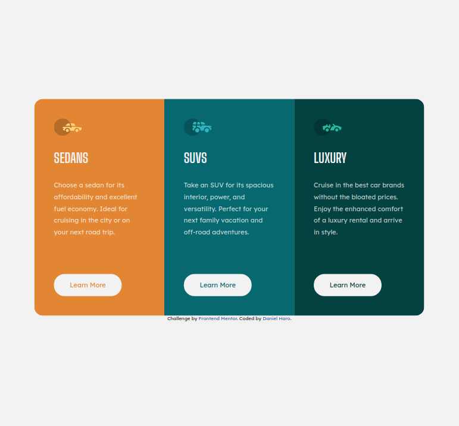

# Frontend Mentor - 3-column preview card component solution

This is a solution to the [3-column preview card component challenge on Frontend Mentor](https://www.frontendmentor.io/challenges/3column-preview-card-component-pH92eAR2-). Frontend Mentor challenges help you improve your coding skills by building realistic projects. 

## Table of contents

- [Overview](#overview)
  - [The challenge](#the-challenge)
  - [Screenshot](#screenshot)
  - [Links](#links)
- [My process](#my-process)
  - [Built with](#built-with)
  - [Continued development](#continued-development)
- [Author](#author)

## Overview

### The challenge

Build out this 3-column preview card component and get it looking as close to the design as possible.

Users should be able to:

- View the optimal layout depending on their device's screen size
- See hover states for interactive elements

### Screenshot

Here's the finished project.

### Links

- Repository URL: [https://github.com/o0oDanielHaroo0o/3-column-preview-card-component](https://github.com/o0oDanielHaroo0o/3-column-preview-card-component)
- Live Site URL: [https://o0odanielharoo0o.github.io/3-column-preview-card-component/](https://o0odanielharoo0o.github.io/3-column-preview-card-component/)

## My process

- I started by analyzing the original design and planning my approach.
- I created the basic HTML structure and gave classes to the elements.
- I typed general styles shared by both mobile and desktop layouts.
- I styled the mobile layout first.
- I created two breakpoints for the layout to change to the desktop version.
- I styled the interactive elements pseudoclasses (hover, active, focus)

### Built with

- Semantic HTML5 markup
- CSS custom properties
- Flexbox

### Continued development

I want to continue practicing responsive designs to get better at them.

I ran into a problem with `the border-radius` of the `.card`. Starting at 1055px screen width it seems to flatten out and ends up looking like a regular box. I fixed it by giving the children elements `.card__column--orange` and `.card__column--dark-cyan` the same `border-radius` as the father. It definitely fixes the problem but I still don't understand why it happened in the first place.

As a side challenge I tried to estimate how long would it take me to finish this challenge. I set a timer for 2 hours and just managed to finish it on time. So I think my estimation was correct but I should give myself a little more time in case I encounter any delays. I'll keep doing this for future challenges to improve my project estimations' skill.

## Author

- Frontend Mentor - [@o0oDanielHaroo0o](https://www.frontendmentor.io/profile/o0oDanielHaroo0o)
- GitHub - [o0oDanielHaroo0o](https://github.com/o0oDanielHaroo0o)